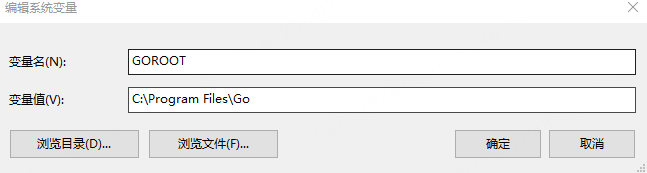
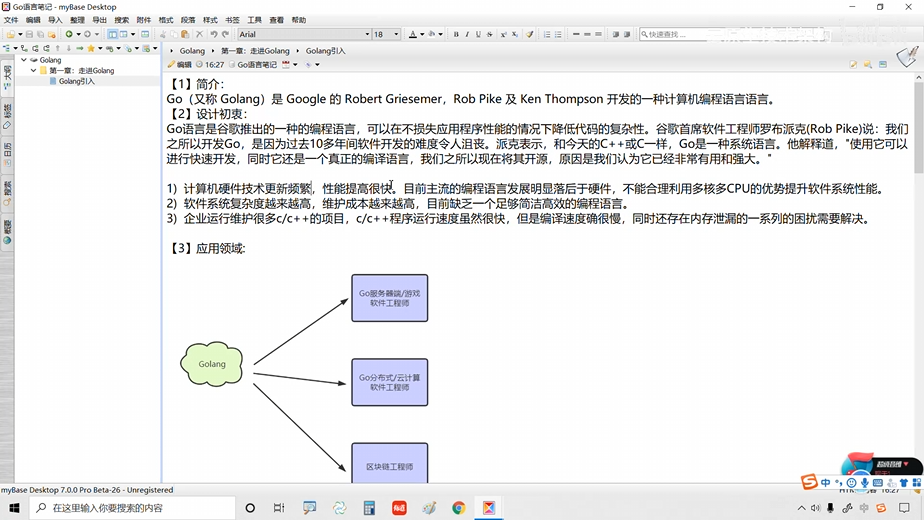

   简介
      go语言 又简称Golang， 是google的开发人员开发的一种计算机编程语言
   设计初衷
      xxxx
   开发工具 
      vscode

   Golang 安装
      安装包下载地址为：https://go.dev/dl/。
      文件安装地址： C:\Program Files\Go  (以本地安装测试举例)
      配置环境变量
         -变量名： GOROOT
         -变量值： C:\Program Files\Go
      
      在path中添加
      %GOROOT%\bin
      然后再重启vscode， 通过 go --version 即可查看go是否安装完成

      
